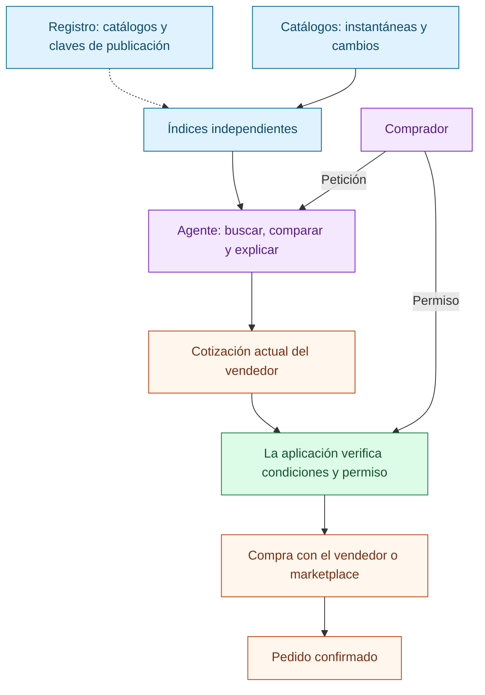

[English](README.md) | [Русский](README.ru.md) | **Español** | [简体中文](README.zh-CN.md)

# Agent Market Protocol

**Conecta un catálogo una vez para que los agentes compatibles encuentren ofertas,
comprueben las condiciones y ayuden al comprador a llegar a un pedido confirmado.**

Agent Market Protocol (AMP, nombre provisional) es un diseño abierto para una red
comercial con índices de búsqueda operados de forma independiente. Los vendedores
conservan sus catálogos y sistemas de pedidos. Los marketplaces pueden publicar
ofertas, atraer compradores o gestionar pedidos y entregas. Los agentes
comparan ofertas y actúan solo dentro de la autorización del comprador.

**Estado: borrador experimental 0.1, 2026-10-03.** Este repositorio contiene la
especificación, esquemas, ejemplos y comprobaciones de documentos. Aún no incluye
una red en funcionamiento, un plugin para tiendas, una integración de pagos de
producción ni un registro desplegado. Publicar un catálogo no hace que todos los
asistentes de IA existentes puedan utilizarlo automáticamente.

**Empieza por [AMP en cinco minutos](docs/how-it-works.es.md):** una compra concreta,
niveles de integración, participación de marketplaces y diagramas de recuperación
cuando faltan cambios del catálogo o se pierde la respuesta de un pedido.

## Recorrido del comprador

«Encuentra un portátil por menos de 1.000 EUR, con entrega en Berlín y al menos
16 GB de RAM».

1. El agente distingue los requisitos de las preferencias y pregunta por los datos esenciales que faltan.
2. Consulta índices independientes adecuados y comprueba datos tipados.
3. Explica una lista reducida de ofertas, incluidos los gastos de entrega desconocidos y la vigencia de los datos.
4. Solicita al vendedor elegido una cotización actual y comprueba el importe total.
5. El comprador aprueba las condiciones exactas o se aplica una autorización previa con límites.
6. El operador de compra confirma un único pedido. Si se pierde la respuesta, el resultado sigue sin resolverse hasta comprobarlo.
7. El comprador o el agente puede seguir la entrega, solicitar una cancelación o pedir un reembolso.

Abrir una página de producto no equivale a confirmar un pedido. El
[recorrido de ejemplo](docs/walkthrough.md) incluye eventos externos simulados.

## A quién beneficia

| Participante | Valor propuesto | Qué falta validar |
|---|---|---|
| Vendedor | Un catálogo reutilizable, compradores interesados y pedidos atribuibles | Esfuerzo de integración y margen adicional |
| Marketplace | Compradores referidos por agentes sin perder su función de compra y servicios | Acuerdo comercial y demanda adicional |
| Aplicación con agente | Reglas comunes de búsqueda, cotizaciones actuales y recuperación de operaciones | Un adaptador funcional para cada sistema de compra admitido |
| Operador de índice | Datos reconstruibles y condiciones explícitas de cobertura y servicio | Costes operativos y clientes que paguen por el servicio |
| Comprador | Comparación explicable y un recorrido continuo hasta el pedido | Éxito en tareas reales y calidad del servicio |

Son objetivos de diseño, no cifras demostradas de ventas o rendimiento.

## Arquitectura



Este es el recorrido de una compra completada. El agente propone; el código de la
aplicación comprueba los límites; el operador verifica la autoridad por su cuenta.
Los resultados pendientes o desconocidos se explican en la
[guía visual](docs/how-it-works.es.md).

Registrar y renovar un catálogo en el registro compartido en cadena requiere el
token de servicio de la red. Los catálogos, las búsquedas, los pedidos personales
y las reseñas permanecen fuera de la cadena. El comprador no necesita una cartera
de criptomonedas para pagar un producto de forma habitual. Un proveedor puede
encargarse del registro por cuenta del vendedor, con delegación, costes y confianza
explícitos.

Todavía no se han elegido la cadena de bloques ni los contratos. El borrador
define [lo que debe ofrecer una integración con la cadena](docs/registry.md),
pero aún no puede afirmar compatibilidad con un registro real. Pagar una cuota de
registro no demuestra la honestidad del vendedor, la independencia de una compra
ni la exhaustividad de la búsqueda.

## Leer el protocolo

Empieza por la [especificación](SPEC.md) y sigue con la
[guía de integración](docs/integration.md). Las reglas normativas están redactadas
en inglés; esta traducción sirve para entender el proyecto y no las sustituye.

| Documento | Contenido |
|---|---|
| [Arquitectura](docs/architecture.md) | Roles, identidades, confianza, marketplaces y versiones |
| [Catálogos](docs/catalogs.md) | Instantáneas, cambios, eliminaciones y reconstrucción de índices |
| [Búsqueda](docs/search.md) | Restricciones tipadas, descubrimiento de índices, cobertura y ordenación |
| [Transacciones](docs/transactions.md) | Cotizaciones, autorizaciones, pedidos y recuperación de resultados |
| [Registro](docs/registry.md) | Registro obligatorio, periodos de vigencia y requisitos de la cadena |
| [Perfiles de nodo](docs/node-profiles.md) | Modos ligero, completo y administrado; recursos necesarios |
| [Economía](docs/token-economics.md) | Tarifas, pagos por servicios, atribución y prevención de abusos |
| [Pruebas y procedencia](docs/evidence.md) | Firmas, observaciones, claves y privacidad |
| [Reputación](docs/reputation.md) | Derecho a reseñar, deduplicación y límites frente a compras propias |
| [Comunidad](docs/community.md) | Reseñas, comprobación de afirmaciones, moderación y apelaciones |
| [Seguridad](docs/security-privacy.md) | Modelo de amenazas y límites de tratamiento de datos |
| [Conformidad](docs/conformance.md) | Requisitos por rol y comprobaciones ejecutables o documentales |
| [Hoja de ruta](docs/roadmap.md) | Dependencias de implementación y criterios de aceptación |
| [Antecedentes](docs/prior-art.md) | Comparaciones fechadas y límites de compatibilidad declarada |
| [Publicaciones](docs/publishing.md) | Comprobaciones y pasos para publicar otra versión |

## Validar el paquete

Se necesita Python 3.12 o posterior. Ejecuta estos comandos desde la raíz del
repositorio:

```sh
python -m venv .venv
# En Linux/macOS, usa .venv/bin/python en lugar de .venv/Scripts/python.exe
.venv/Scripts/python.exe -m pip install -r requirements-dev.txt
.venv/Scripts/python.exe tools/generate_schemas.py
.venv/Scripts/python.exe tools/generate_examples.py
.venv/Scripts/python.exe tools/check.py
.venv/Scripts/python.exe -m pytest
```

Los esquemas generados están en [schemas/0.1](schemas/0.1/) y los ejemplos en
[examples](examples/). Las claves de firma de prueba son ejemplos públicos; no
deben usarse en operaciones reales. Estas comprobaciones no simulan una cadena de
bloques real, un sistema de compra, un proveedor logístico ni una comunidad de
reputación. Consulta el [alcance de conformidad](docs/conformance.md) para conocer
los límites exactos.
