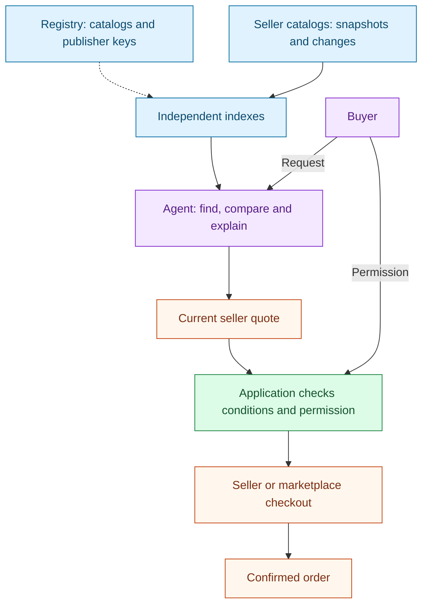

**English** | [Русский](README.ru.md) | [Español](README.es.md) | [简体中文](README.zh-CN.md)

# Agent Market Protocol

**Connect a catalog once. Let compatible agents find offers, check the conditions,
and help a buyer reach a confirmed order.**

Agent Market Protocol (AMP, working name) is an open design for a commerce network
with independently operated search indexes. Sellers keep their catalogs and order
systems. Marketplaces can publish offers, bring buyers or provide fulfillment.
Agents compare offers and act only within the buyer's permission.

**Status: Experimental Draft 0.1, 2026-10-03.** This repository contains a
specification, schemas, examples and document checks. It does not contain a running
network, store plugin, production payment integration or deployed registry.
Publishing a catalog does not make every existing AI assistant able to use it.

**Start with [AMP in five minutes](docs/how-it-works.md):** a concrete purchase,
store integration levels, marketplace participation, and diagrams showing recovery
when catalog updates or an order response are lost.

## A buyer's journey

“Find a laptop under EUR 1,000 delivered to Berlin, with at least 16 GB RAM.”

1. The agent separates requirements from preferences and asks about missing essentials.
2. It queries suitable independent indexes and checks typed facts.
3. It explains a shortlist, including unknown delivery costs and data freshness.
4. It asks the selected seller for a current quote and validates the total.
5. The buyer approves the exact conditions, or an existing bounded permission applies.
6. The checkout operator confirms one order. A timeout remains unresolved until checked.
7. The buyer or agent can follow delivery, request cancellation or request a refund.

Opening a product page alone is not a confirmed order. A sample journey, with
simulated external events, is in [the walkthrough](docs/walkthrough.md).

## Who benefits

| Participant | Proposed value | What still needs validation |
|---|---|---|
| Seller | One reusable catalog; qualified buyers; attributable orders | Integration effort and incremental margin |
| Marketplace | Agent referrals with its own checkout and service role retained | Commercial agreement and additional demand |
| Agent application | Common search semantics, current quotes and recovery rules | A working adapter to each supported checkout |
| Index operator | Rebuildable input and a declared coverage/service contract | Operating cost and paying customers |
| Buyer | Explainable comparison and a continuous purchase journey | Real task success and service quality |

These are design goals, not measured sales or performance claims.

## Architecture



This is the successful purchase path. The agent proposes; application code checks
the buyer's limits; the checkout operator independently verifies authority. Pending
or unknown results remain unresolved, as shown in the [visual guide](docs/how-it-works.md).

Registration and renewal in the shared on-chain registry require the network's
service token. Catalogs, searches, personal orders and reviews remain off-chain.
Ordinary product payments do not require a cryptocurrency wallet. A provider may
handle registration for a seller, with explicit delegation, costs and trust.

The blockchain and contract deployment are deliberately not selected. The draft
defines [what a chain binding must supply](docs/registry.md); it cannot yet claim
interoperability with a real registry. Payment of registration fees does not prove
seller honesty, purchase independence or search completeness.

## Read the protocol

Start with [the specification](SPEC.md), then [the integration guide](docs/integration.md).

| Document | Subject |
|---|---|
| [Architecture](docs/architecture.md) | Roles, identities, trust, marketplaces and versioning |
| [Catalogs](docs/catalogs.md) | Snapshots, changes, deletions and rebuilding an index |
| [Search](docs/search.md) | Typed constraints, index discovery, coverage and ranking |
| [Transactions](docs/transactions.md) | Quotes, permission, orders, recovery and handoff |
| [Registry](docs/registry.md) | Mandatory registration, leases and chain-binding requirements |
| [Node profiles](docs/node-profiles.md) | Light, full and managed modes; resource targets |
| [Economics](docs/token-economics.md) | Fees, service payments, attribution and abuse |
| [Evidence](docs/evidence.md) | Signatures, observations, keys and privacy |
| [Reputation](docs/reputation.md) | Review eligibility, deduplication and self-purchase limits |
| [Community](docs/community.md) | Reviews, fact checks, moderation and appeals |
| [Security](docs/security-privacy.md) | Threat model and data boundaries |
| [Conformance](docs/conformance.md) | Role requirements and executable/documentary checks |
| [Roadmap](docs/roadmap.md) | Implementation dependencies and acceptance gates |
| [Prior art](docs/prior-art.md) | Dated comparisons and limits of compatibility claims |
| [Releases](docs/publishing.md) | Checks and steps for publishing a new draft |

## Validate this package

Python 3.12 or newer. Run from this directory, including after moving it:

```sh
python -m venv .venv
# Linux/macOS: use .venv/bin/python instead of .venv/Scripts/python.exe
.venv/Scripts/python.exe -m pip install -r requirements-dev.txt
.venv/Scripts/python.exe tools/generate_schemas.py
.venv/Scripts/python.exe tools/generate_examples.py
.venv/Scripts/python.exe tools/check.py
.venv/Scripts/python.exe -m pytest
```

Generated schemas are in [schemas/0.1](schemas/0.1/); examples are in
[examples](examples/). Test signing keys are public fixtures, never operational keys.
Checks do not simulate a real blockchain, checkout, logistics provider or reputation
community. See [conformance](docs/conformance.md) for the precise boundary.
