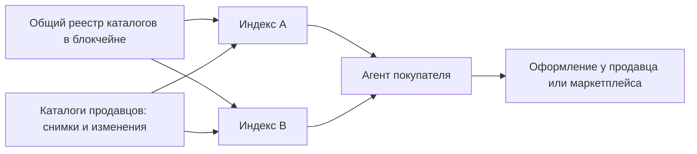

**Русский** | [English](README.md) | [Español](README.es.md) | [简体中文](README.zh-CN.md)

# Agent Market Protocol

**Один раз подключить каталог, чтобы совместимые агенты могли находить предложения,
проверять условия и помогать покупателю дойти до подтверждённого заказа.**

Agent Market Protocol (AMP, рабочее название) — открытый проект торговой сети с
независимыми поисковыми индексами. Продавцы сохраняют свои каталоги и системы
заказов. Маркетплейсы могут публиковать предложения, приводить покупателей,
оформлять заказы и организовывать доставку. Агенты сравнивают предложения и
действуют только в пределах разрешения покупателя.

**Статус: экспериментальный черновик 0.1 от 2026-10-03.** В репозитории есть
спецификация, схемы, примеры и проверки документов. Работающей сети, плагина
магазина, интеграции с реальными платежами и развёрнутого реестра здесь пока нет.
Публикация каталога сама по себе не делает его доступным каждому существующему
ИИ-ассистенту.

## Путь покупателя

«Найди ноутбук дешевле 1 000 EUR с доставкой в Берлин и не менее 16 ГБ памяти».

1. Агент отделяет обязательные условия от предпочтений и уточняет недостающие данные.
2. Он обращается к подходящим независимым индексам и проверяет типизированные данные.
3. Он объясняет короткий список предложений, включая неизвестные расходы на доставку и свежесть данных.
4. Он запрашивает у выбранного продавца актуальные условия и проверяет итоговую сумму.
5. Покупатель одобряет точные условия либо применяет ранее выданное ограниченное разрешение.
6. Оператор оформления подтверждает один заказ. Если ответ потерян, результат остаётся неизвестным до проверки.
7. Покупатель или агент отслеживает доставку, запрашивает отмену или возврат.

Открытая карточка товара ещё не означает подтверждённый заказ. Полный пример пути,
в котором внешние события смоделированы, приведён в [сценарии](docs/walkthrough.md).

## Кому это выгодно

| Участник | Предполагаемая польза | Что ещё нужно проверить |
|---|---|---|
| Продавец | Один повторно используемый каталог, заинтересованные покупатели, прослеживаемые заказы | Сложность подключения и дополнительная прибыль |
| Маркетплейс | Покупатели от агентов при сохранении собственной роли в оформлении и услугах | Коммерческие условия и дополнительный спрос |
| Приложение с агентом | Общие правила поиска, актуальные условия и восстановление результата операции | Рабочая интеграция с каждой поддерживаемой системой оформления |
| Оператор индекса | Восстанавливаемый источник данных и явные условия покрытия и обслуживания | Стоимость работы и наличие платящих клиентов |
| Покупатель | Понятное сравнение и непрерывный путь до заказа | Успешность реальных покупок и качество обслуживания |

Это цели проекта, а не подтверждённые показатели продаж или скорости работы.

## Архитектура



Регистрация и продление записи в общем реестре требуют собственного служебного
токена сети. Каталоги, поиск, личные заказы и отзывы остаются вне блокчейна.
Для обычной оплаты товара покупателю не нужен криптокошелёк. Поставщик услуг
может зарегистрировать каталог за продавца при явном делегировании полномочий,
расходов и модели доверия.

Конкретный блокчейн и контракты ещё не выбраны. Черновик описывает
[требования к привязке сети](docs/registry.md), поэтому совместимость с
работающим реестром пока не заявляется. Оплата регистрации не доказывает
честность продавца, независимость покупки или полноту поиска.

## Документы протокола

Начните с [основной спецификации](SPEC.md), затем прочитайте
[руководство по подключению](docs/integration.md). Нормативные правила написаны
по-английски; этот перевод помогает разобраться в проекте, но не заменяет их.

| Документ | О чём он |
|---|---|
| [Архитектура](docs/architecture.md) | Роли, идентификаторы, доверие, маркетплейсы и версии |
| [Каталоги](docs/catalogs.md) | Снимки, изменения, удаления и восстановление индекса |
| [Поиск](docs/search.md) | Типизированные условия, поиск индексов, покрытие и ранжирование |
| [Сделки](docs/transactions.md) | Условия продажи, разрешения, заказы и восстановление результата |
| [Реестр](docs/registry.md) | Обязательная регистрация, сроки действия и требования к блокчейну |
| [Режимы нод](docs/node-profiles.md) | Лёгкий, полный и обслуживаемый режимы; требования к ресурсам |
| [Экономика](docs/token-economics.md) | Платежи за услуги, вознаграждения за привлечение и защита от злоупотреблений |
| [Доказательства](docs/evidence.md) | Подписи, наблюдения, ключи и приватность |
| [Репутация](docs/reputation.md) | Право на отзыв, устранение дублей и ограничения на самопокупки |
| [Сообщество](docs/community.md) | Отзывы, проверка утверждений, модерация и апелляции |
| [Безопасность](docs/security-privacy.md) | Модель угроз и границы обработки данных |
| [Соответствие](docs/conformance.md) | Требования к ролям и выполняемые или документальные проверки |
| [План работ](docs/roadmap.md) | Зависимости реализации и критерии готовности |
| [Предшествующие проекты](docs/prior-art.md) | Сравнения на определённую дату и пределы заявленной совместимости |
| [Выпуски](docs/publishing.md) | Проверки и шаги публикации новой версии |

## Проверка пакета

Нужен Python 3.12 или новее. Выполните команды в корне этого репозитория:

```sh
python -m venv .venv
# В Linux/macOS используйте .venv/bin/python вместо .venv/Scripts/python.exe
.venv/Scripts/python.exe -m pip install -r requirements-dev.txt
.venv/Scripts/python.exe tools/generate_schemas.py
.venv/Scripts/python.exe tools/generate_examples.py
.venv/Scripts/python.exe tools/check.py
.venv/Scripts/python.exe -m pytest
```

Созданные схемы находятся в [schemas/0.1](schemas/0.1/), примеры — в
[examples](examples/). Ключи для тестовых подписей входят в открытые примеры и
не предназначены для реальных операций. Проверки не воспроизводят настоящую
работу блокчейна, оформления заказов, доставки или репутационного сообщества.
Точные границы проверок описаны в [документе о соответствии](docs/conformance.md).
