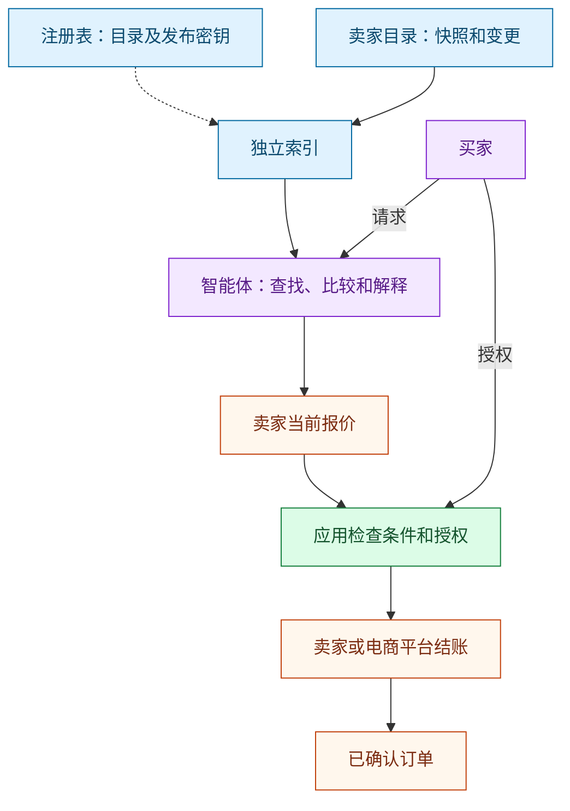

[English](README.md) | [Русский](README.ru.md) | [Español](README.es.md) | **简体中文**

# Agent Market Protocol

**接入一次商品目录，让兼容的智能体发现商品、核对交易条件，并帮助买家完成已确认的订单。**

Agent Market Protocol（AMP，暂用名称）是一套开放的商业网络设计，支持由不同
运营方独立维护搜索索引。卖家保留自己的商品目录和订单系统。电商平台可以发布
商品、带来买家，或提供结账与履约服务。智能体可以比较商品，但只能在买家授权
的范围内行动。

**状态：2026-10-03 发布的 0.1 实验草案。** 本仓库包含规范、模式文件、示例和
文档检查工具。目前没有运行中的网络、商店插件、生产环境支付集成或已部署的注册
表。发布商品目录也不会让所有现有 AI 助手自动支持该目录。

**先阅读[五分钟了解 AMP](docs/how-it-works.zh-CN.md)：**通过具体购买示例了解商店
接入层级、平台参与方式，以及目录更新缺失或下单响应丢失时的恢复流程图。

## 买家的购买过程

“帮我找一台价格低于 1,000 欧元、可以送到柏林、内存至少 16 GB 的笔记本电脑。”

1. 智能体区分必须满足的条件和个人偏好，并询问缺少的关键信息。
2. 智能体查询合适的独立索引，核对有明确类型的商品数据。
3. 智能体解释候选商品，包括尚不确定的运费和数据更新时间。
4. 智能体向选定的卖家索取当前报价，并核对最终金额。
5. 买家批准具体条件，或使用此前授予的、有明确限制的授权。
6. 结账服务方确认一笔订单。若响应丢失，必须查询结果，不能直接认定下单成功。
7. 买家或智能体可以跟踪配送、申请取消订单或要求退款。

打开商品页面并不等于订单已确认。[完整示例](docs/walkthrough.md)展示了整个过程，
其中的外部事件均为模拟数据。

## 各参与方能获得什么

| 参与方 | 预期价值 | 仍需验证的事项 |
|---|---|---|
| 卖家 | 一份可重复使用的商品目录、更有购买意向的买家、可追溯的订单来源 | 接入成本和新增利润 |
| 电商平台 | 获得智能体带来的买家，同时保留自身的结账和服务角色 | 商业协议及新增需求 |
| 智能体应用 | 一致的搜索规则、最新报价和操作结果恢复规则 | 与每种受支持的结账系统实现可用的适配器 |
| 索引运营方 | 可重建的数据源，以及明确的覆盖范围和服务约定 | 运营成本和付费客户 |
| 买家 | 可解释的商品比较，以及直到下单的连续体验 | 真实购买任务的完成率和服务质量 |

这些都是设计目标，并非已经验证的销量或性能数据。

## 架构



图中展示成功购买的路径：智能体提出行动，应用代码核验买家的限制，结账服务方
独立检查权限。等待中和结果未知的情况见[图解指南](docs/how-it-works.zh-CN.md)。

在共享链上注册表中注册和续期商品目录，需要使用网络的服务代币。商品目录、
搜索、个人订单和评价保留在链下。买家用普通方式支付商品时不需要加密货币钱包。
服务商可以代表卖家办理注册，但必须明确代理权限、费用和信任关系。

草案尚未选定具体区块链和合约部署方式。[注册表文档](docs/registry.md)列出了
链上集成必须满足的条件，因此目前不能声称已与真实注册表互通。缴纳注册费也
不能证明卖家诚实、交易独立，或搜索结果完整。

## 阅读协议

建议先阅读[主规范](SPEC.md)，再看[接入指南](docs/integration.md)。具有规范效力
的规则使用英语编写；本译文帮助理解项目，不替代英文规范。

| 文档 | 内容 |
|---|---|
| [架构](docs/architecture.md) | 角色、身份、信任关系、电商平台和版本规则 |
| [商品目录](docs/catalogs.md) | 快照、变更、删除以及索引重建 |
| [搜索](docs/search.md) | 结构化条件、索引发现、覆盖范围和排序 |
| [交易](docs/transactions.md) | 报价、授权、订单以及结果恢复 |
| [注册表](docs/registry.md) | 强制注册、有效期和链上集成要求 |
| [节点模式](docs/node-profiles.md) | 轻节点、全节点和托管模式；资源要求 |
| [经济机制](docs/token-economics.md) | 服务费用、引荐归因和防滥用机制 |
| [证据](docs/evidence.md) | 签名、观察记录、密钥和隐私 |
| [信誉](docs/reputation.md) | 评价资格、去重和自买限制 |
| [社区](docs/community.md) | 评价、事实核查、内容管理和申诉 |
| [安全](docs/security-privacy.md) | 威胁模型和数据处理边界 |
| [符合性](docs/conformance.md) | 各角色要求、可执行检查和文档场景 |
| [路线图](docs/roadmap.md) | 实现依赖和验收条件 |
| [相关项目](docs/prior-art.md) | 截至指定日期的比较及兼容性声明边界 |
| [版本发布](docs/publishing.md) | 发布新版草案的检查和步骤 |

## 验证本仓库

需要 Python 3.12 或更高版本。在仓库根目录运行：

```sh
python -m venv .venv
# 在 Linux/macOS 上，请用 .venv/bin/python 替换 .venv/Scripts/python.exe
.venv/Scripts/python.exe -m pip install -r requirements-dev.txt
.venv/Scripts/python.exe tools/generate_schemas.py
.venv/Scripts/python.exe tools/generate_examples.py
.venv/Scripts/python.exe tools/check.py
.venv/Scripts/python.exe -m pytest
```

生成的模式文件位于 [schemas/0.1](schemas/0.1/)，示例位于
[examples](examples/)。测试签名密钥是公开示例，不能用于实际交易。这些检查不会
模拟真实区块链、结账系统、物流服务商或信誉社区。具体的验证范围见
[符合性文档](docs/conformance.md)。
