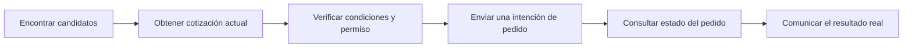
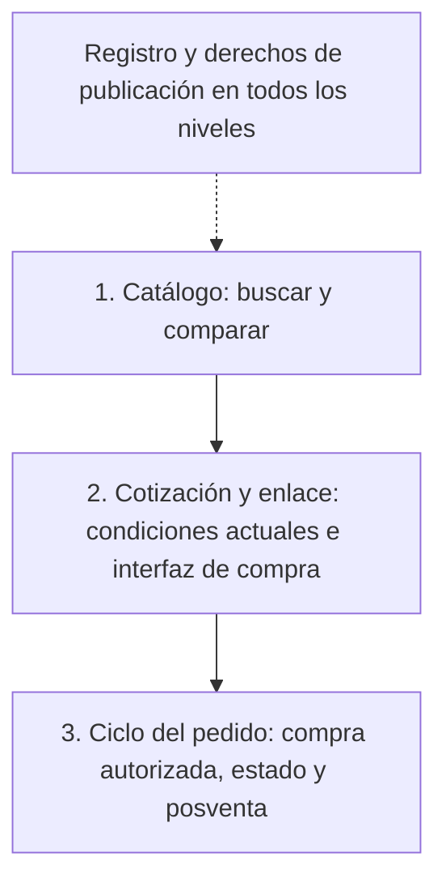
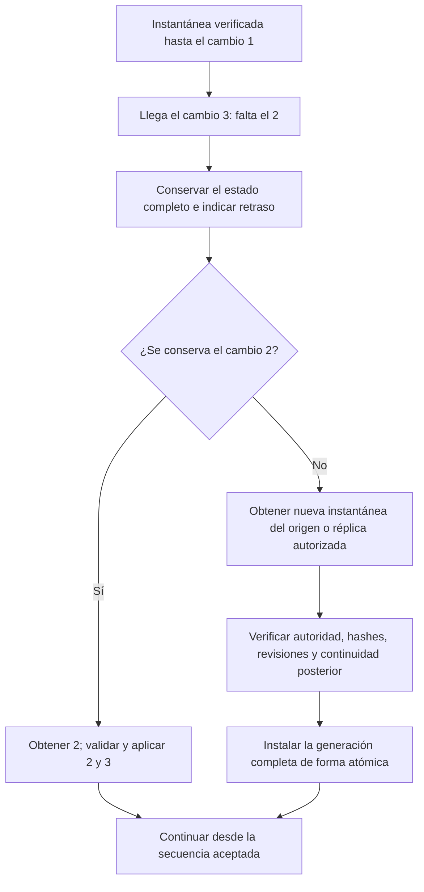
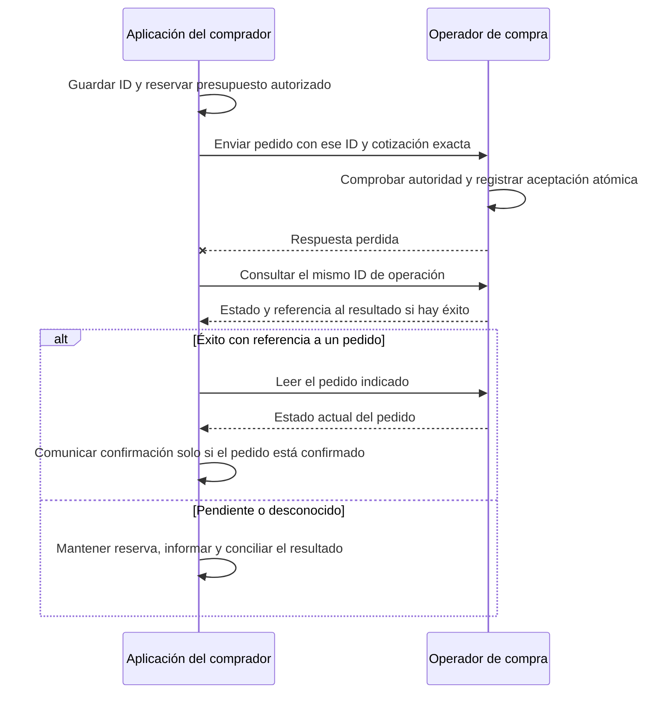

[English](how-it-works.md) | [Русский](how-it-works.ru.md) | **Español** | [简体中文](how-it-works.zh-CN.md)

# AMP en cinco minutos

[Volver al README](../README.es.md)

AMP conecta la petición de un comprador con los catálogos y los sistemas de pedidos
de los vendedores. Los índices independientes ayudan a descubrir ofertas. El agente
explica las opciones; la aplicación del comprador verifica condiciones y permisos;
el vendedor o el marketplace acepta el pedido.

Esta guía explica el borrador experimental. Los diagramas muestran el comportamiento
previsto de los servicios. El repositorio ofrece documentos y comprobaciones locales.
Las reglas normativas se encuentran en la [especificación en inglés](../SPEC.md).

## Una compra en cuatro etapas

**Petición:** «Un portátil con al menos 16 GB de RAM, entrega en Berlín y un total
inferior a 1.000 EUR». Los ejemplos son ficticios y se evalúan en el instante de
prueba del 2026-10-03; no son ofertas actuales.

| Etapa | Qué ve el comprador | Qué ocurre detrás |
|---|---|---|
| 1. Buscar | Una selección y las fuentes consultadas | Los índices proponen candidatos; la aplicación comprueba requisitos y vigencia |
| 2. Comparar | Diferencias conocidas, datos ausentes y componentes del precio | El precio publicado se distingue del total personalizado con entrega |
| 3. Autorizar | Vendedor, artículo, cantidad, total y entrega concretos | Una interacción de confianza registra un permiso limitado; el modelo no puede ampliarlo |
| 4. Finalizar | Pedido confirmado, resultado pendiente o rechazo explícito | La aplicación consulta el estado del pedido; el estado del pago se verifica por separado |

El [resultado de ejemplo](../examples/valid/search-result.json) contiene:

| Oferta | RAM | Precio publicado del artículo | Entrega y total antes de la cotización |
|---|---|---|---|
| [Vendedor A](../examples/valid/offer-a.json) | 16 GB | 899 EUR | Desconocidos |
| [Vendedor B](../examples/valid/offer-b.json) | 16 GB | 949 EUR | Desconocidos |
| [Vendedor C mediante un marketplace](../examples/valid/offer-c.json) | 16 GB | 929 EUR | Desconocidos |

Los tres anuncian cobertura en Berlín; aún falta comprobar la dirección concreta.
La [cotización de A](../examples/valid/quote.json) confirma después:
899 EUR + 10 EUR de entrega = **909 EUR**, sin costes externos desconocidos en este
ejemplo. No se incluyen cotizaciones de B y C, por lo que no se demuestra cuál es
la oferta más barata con entrega. Una cotización tampoco reserva existencias por defecto.

Un permiso previo solo sirve dentro de sus límites. Cambiar precio o dirección puede
requerir otra cotización y autorización. El agente puede transferir el mismo pedido
o sesión a una interfaz humana; abrirla no demuestra que la compra se haya completado.

## Quién controla cada parte

| Participante | Responsabilidad | Límite |
|---|---|---|
| Vendedor | Publica ofertas y condiciones actuales | Registrarse no demuestra que una oferta sea cierta |
| Índice | Hace consultables los catálogos declarados | La cobertura puede ser parcial; un resultado no autoriza gastos |
| Aplicación del comprador | Conserva la intención, verifica hechos y aplica permisos | El modelo no cambia límites, credenciales ni confianza |
| Operador de compra | Comprueba autoridad, acepta pedidos y publica su estado | Un marketplace necesita autoridad para cada vendedor representado |
| Registro | Conserva la inscripción y las claves autorizadas del catálogo | No almacena pedidos personales ni elige el mejor producto |

El registro y la indexación pública permiten descubrir ofertas. La cotización y el
pedido se envían al servicio autorizado elegido. Cada compra no requiere su propia
nueva transacción de inscripción del catálogo. El estado de registro aceptado sigue
sujeto a las reglas de vigencia y fallos de la red.

## Cómo se conecta una tienda

Son niveles de integración, no instaladores disponibles. La tienda elige el nivel
necesario; puede delegar tareas concretas a un proveedor.

| Nivel | Qué conecta la tienda | Qué puede hacer el agente compatible |
|---|---|---|
| Catálogo | Identificadores estables, datos tipados, instantánea, cambios y registro | Buscar, comparar y abrir una oferta |
| Cotización y enlace | Precios actuales, comprobación de dirección y sesión de compra de confianza | Preparar la compra; puede requerir que una persona la termine |
| Ciclo del pedido | Aplicación de permisos, API de pedidos y estado, acciones de posventa admitidas | Completar y seguir un pedido autorizado según la integración |

El registro es obligatorio en todos los niveles de participación activa. Pagar no
obliga a cada índice a incluir el catálogo. Un proveedor puede gestionar registro y
alojamiento con un presupuesto explícito; el vendedor conserva la propiedad y una
vía para cambiar de proveedor. El adaptador y la integración real de red aún deben implementarse.

## Por qué participaría un marketplace

En el ejemplo de C, la plataforma conserva la compra y la entrega. El agente trae al
comprador y la plataforma mantiene sus servicios bajo los permisos acordados. El
perfil actual usa un catálogo por vendedor y la delegación correspondiente.

La atribución de la recomendación se acuerda antes de finalizar. El precio, los
requisitos y las consecuencias de un reembolso dependen del acuerdo comercial.
Un piloto debe medir pedidos confirmados adicionales, margen y trabajo de soporte;
estos beneficios aún no se han medido.

## Adónde van los datos y el dinero

| Flujo | Datos intercambiados | Acceso y pago |
|---|---|---|
| Registro del catálogo | Identidad, autoridad de publicación y compromisos criptográficos | Registro público; token de servicio y posible gas de la cadena |
| Búsqueda y almacenamiento | Copias permitidas, región aproximada y filtros necesarios | Acuerdos separados; la tarifa de registro no paga automáticamente estos servicios |
| Cotización y pedido | Dirección exacta, condiciones aceptadas y detalles del pedido | Solo partes autorizadas; el producto se paga por un medio admitido por el vendedor |
| Recomendación | Atribución acordada de un pedido elegible | Paga el vendedor o la plataforma según el acuerdo; se revelan los incentivos |

Las credenciales de pago no entran en los mensajes al modelo ni en catálogos públicos.
El comprador habitual no necesita una cartera de criptomonedas para pagar un producto.
El token de servicio sigue siendo obligatorio para registrar y renovar catálogos.

## Si un índice pierde cambios

El índice carga una instantánea verificada y aplica cambios consecutivos. Un cambio
ausente no se interpreta como «no hay productos».

Si falla la reconstrucción, se conserva la generación completa anterior indicando
su vigencia real. Las ofertas caducadas no pasan como actuales. Las marcas de
eliminación conservan revisiones de ofertas borradas. Se informa de fuentes no
disponibles y cobertura requerida incompleta. Si desaparecen todas las copias
autorizadas, un hash del registro no recupera el catálogo.

## Si se pierde la respuesta del pedido

El ID de operación se guarda antes del envío. La recuperación usa el mismo ID,
comprador, operador y red. Un tiempo de espera agotado no autoriza otra compra.

El éxito de una operación por sí solo no demuestra un pago ni un pedido confirmado.
Una vez agotado el periodo admitido de reintentos, se detienen los reintentos
automáticos y se sigue el procedimiento de conciliación de la integración.
Los pedidos y los pagos mantienen estados separados.

## Para continuar

- [Integración](integration.md): obligaciones por rol y nivel.
- [Recorrido completo](walkthrough.md): el mismo ejemplo con mensajes concretos.
- [Catálogos](catalogs.md) y [búsqueda](search.md): sincronización, vigencia y cobertura.
- [Transacciones](transactions.md): permisos, idempotencia y recuperación.
- [Conformidad](conformance.md): alcance de las comprobaciones locales y de una implementación operativa.
