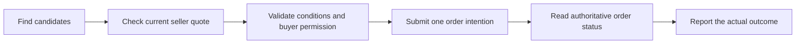
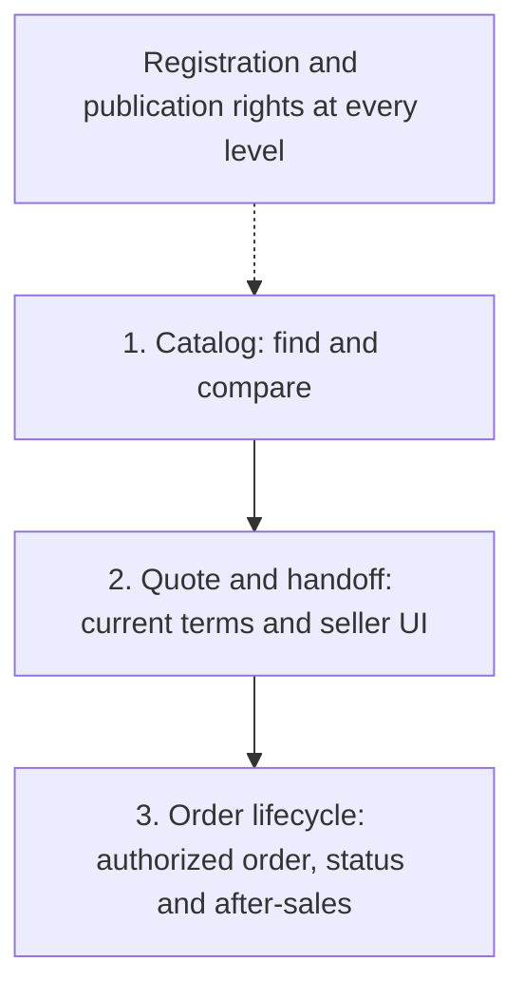
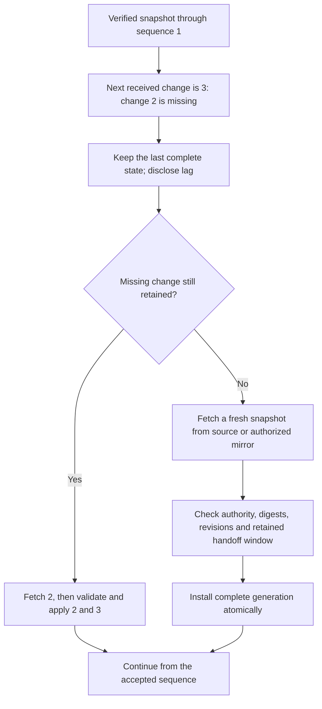

**English** | [Русский](how-it-works.ru.md) | [Español](how-it-works.es.md) | [简体中文](how-it-works.zh-CN.md)

# AMP in five minutes

[Back to README](../README.md)

AMP connects a buyer's request to sellers' catalogs and order systems. Independent
indexes help discover offers. The agent explains choices; the buyer's application
checks conditions and permissions; the seller or marketplace accepts the order.

This is an explanatory guide to the experimental draft. The diagrams describe the
intended service behavior. The repository currently provides documents and offline
checks. The [English specification](../SPEC.md) defines the normative rules.

## One purchase, four stages

**Request:** “A laptop with at least 16 GB RAM, delivered to Berlin, total under
EUR 1,000.” These fictional examples are evaluated at the fixture time on
2026-10-03; they are not current offers.

| Stage | What the buyer sees | What happens behind it |
|---|---|---|
| 1. Find | A shortlist and the sources searched | Indexes return candidates; the application checks hard requirements and freshness |
| 2. Compare | Known differences, missing facts and price components | A published item price is kept separate from a personalized delivered total |
| 3. Approve | Exact seller, item, quantity, total and delivery conditions | A trusted interaction records bounded permission; the model cannot enlarge it |
| 4. Finish | Confirmed order, pending result or an explicit failure | The application reconciles the operator's order state; payment status is separate |

The [sample result](../examples/valid/search-result.json) contains:

| Offer | RAM | Published item price | Delivery and final total before quote |
|---|---|---|---|
| [Seller A](../examples/valid/offer-a.json) | 16 GB | EUR 899 | Unknown |
| [Seller B](../examples/valid/offer-b.json) | 16 GB | EUR 949 | Unknown |
| [Seller C via a marketplace](../examples/valid/offer-c.json) | 16 GB | EUR 929 | Unknown |

All three advertise Berlin coverage. That does not establish delivery to a precise
address. Seller A's [example quote](../examples/valid/quote.json) later confirms
EUR 899 + EUR 10 delivery = **EUR 909**, with no unknown external costs in this
fixture. Quotes for B and C are not supplied, so the example does not establish
the cheapest delivered offer. A quote also does not reserve stock by default.



An existing permission can be used only within its bounds. A changed price or
destination can require a new quote and permission. An agent can hand the same
order or session to a human UI; opening that UI is not proof of completion.

## Who controls what

| Participant | Responsibility | Boundary |
|---|---|---|
| Seller | Publishes offers and current terms | Registration does not prove the offer is truthful |
| Index | Builds a searchable view of declared catalogs | Coverage can be partial; a search result cannot authorize spending |
| Buyer application | Records intent, checks facts and enforces permission | Model output cannot change limits, credentials or trust |
| Checkout operator | Independently checks authority, accepts orders and exposes status | A marketplace needs authority for each represented seller |
| Registry | Records catalog registration and authorized publishing keys | It does not store personal orders or decide which product is best |

Registry checks and public indexing support discovery. The quote and order go to
the selected authorized service. A purchase does not require a new catalog
registration transaction of its own. Accepted registration state still has to
satisfy the network's freshness and outage policy.

## How a store starts

These are integration levels, not available installer packages. A store can target
the level it needs; a provider can perform explicitly delegated work.



| Level | What the store connects | What a compatible agent can do |
|---|---|---|
| Catalog | Stable offer IDs, typed facts, snapshot, changes and registration | Find, compare and link to an offer |
| Quote and handoff | Current pricing, destination checks and a trusted checkout session | Prepare the purchase; a human may still finish it |
| Order lifecycle | Authorization enforcement, order/status APIs and supported after-sales actions | Complete and track an authorized order, subject to the binding |

Registration is mandatory at every active network level. Paying it does not force
every index to ingest the catalog. Managed onboarding can handle registration and
hosting within a stated budget; the seller retains ownership and a provider exit
path. An actual adapter and network binding still need to be implemented.

## Why a marketplace would participate

Seller C's example retains the marketplace as checkout operator and fulfillment
provider. The agent brings a buyer; the platform can keep its order flow and service
relationship under the agreed permissions. The current profile uses a separate
catalog per seller, with the relevant delegation.

Referral attribution is agreed before completion. Its price, eligibility and refund
treatment come from a commercial agreement. A pilot must measure additional
confirmed orders, margin and support work; these benefits are not measured yet.

## Where data and money go

| Flow | What is exchanged | Visibility and payment |
|---|---|---|
| Catalog registration | Catalog identity, publisher authority and commitments | Public registry; service-token fee and any native gas |
| Search and storage | Permitted catalog copies, coarse region and needed filters | Separate service agreements; registry fees do not automatically pay these operators |
| Quote and order | Precise destination, accepted terms and order details | Restricted to authorized parties; product payment uses the seller's supported payment method |
| Referral | Agreed attribution for an eligible order | Seller/platform pays under its agreement; incentives are disclosed |

Payment credentials stay out of model prompts and public catalogs. An ordinary
buyer does not need a cryptocurrency wallet to pay for a product. The network's
service token remains required for catalog registration and renewal.

## If an index misses updates

An index loads a verified snapshot, then applies consecutive changes. A missing
change does not become an empty search result.



A failed rebuild keeps the previous complete generation, with honest freshness
status. Expired offers cannot pass as current matches. Tombstones preserve deleted
offer revisions. An unavailable source or incomplete required coverage is reported.
If all authorized copies disappear, a registry hash cannot restore the catalog.

## If the order response is lost

The operation ID is saved before dispatch. It is reused for recovery with the same
principal, operator and network. A timeout alone does not permit a second purchase.

```mermaid
sequenceDiagram
    participant A as Buyer application
    participant C as Checkout operator
    A->>A: Save operation ID and reserve permission budget
    A->>C: Submit order with that ID and exact quote
    C->>C: Check authority and atomically record acceptance
    C--xA: Response lost
    A->>C: Look up the same operation ID
    C-->>A: Operation status and result reference when succeeded
    alt Succeeded with an order reference
        A->>C: Read the referenced order
        C-->>A: Current order state
        A->>A: Say confirmed only if the order is confirmed
    else Pending or unknown
        A->>A: Preserve reservation; report unresolved and reconcile
    end
```

An operation's success is not by itself proof of payment or a confirmed order.
Beyond the operator's retry-retention window, automatic retries stop and the
binding's reconciliation process applies. Confirmed orders and payment events have
separate states.

## Continue from here

- [Integration guide](integration.md): obligations by role and level.
- [Documentary walkthrough](walkthrough.md): the same journey with concrete messages.
- [Catalogs](catalogs.md) and [search](search.md): synchronization, freshness and coverage.
- [Transactions](transactions.md): permission, idempotency and recovery.
- [Conformance](conformance.md): what the offline checks establish and what needs a running implementation.
