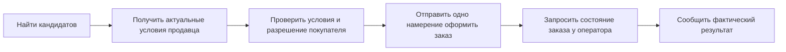
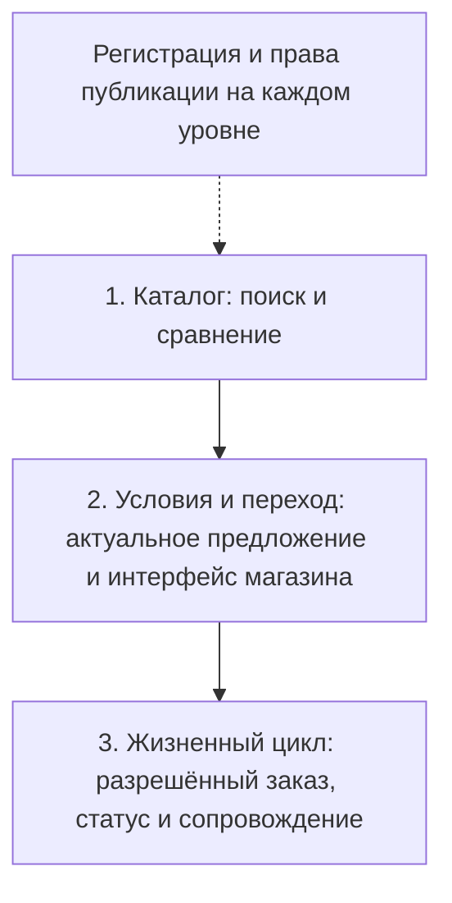
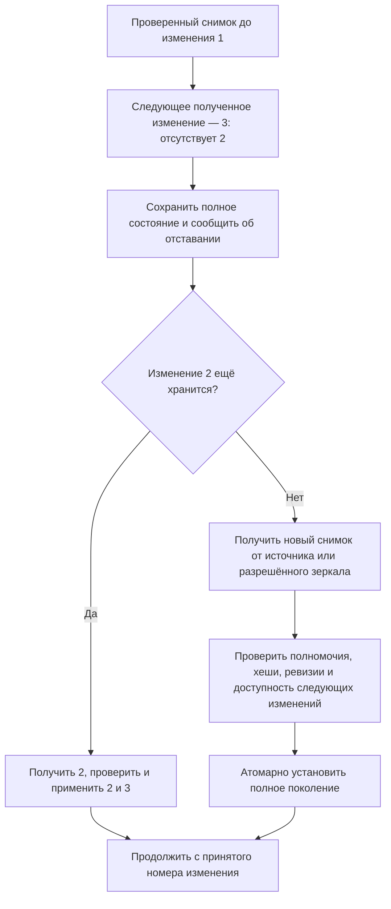
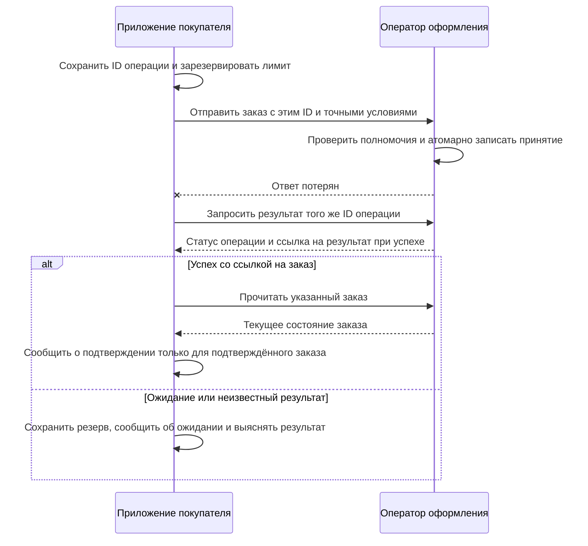

[English](how-it-works.md) | **Русский** | [Español](how-it-works.es.md) | [简体中文](how-it-works.zh-CN.md)

# AMP за пять минут

[Вернуться к README](../README.ru.md)

AMP связывает запрос покупателя с каталогами и системами заказов продавцов.
Независимые индексы помогают найти предложения. Агент объясняет выбор, приложение
покупателя проверяет условия и разрешения, а магазин или маркетплейс принимает заказ.

Это пояснение к экспериментальному черновику. Схемы показывают предусмотренное
поведение сервисов. Сейчас в репозитории есть документы и офлайн-проверки.
Нормативные правила определяет [английская спецификация](../SPEC.md).

## Одна покупка, четыре этапа

**Запрос:** «Ноутбук с памятью от 16 ГБ, доставка в Берлин, общая стоимость меньше
1 000 EUR». Примеры вымышлены и оцениваются на тестовый момент 2026-10-03;
это не актуальные предложения магазинов.

| Этап | Что видит покупатель | Что за этим происходит |
|---|---|---|
| 1. Найти | Короткий список и перечень опрошенных источников | Индексы возвращают кандидатов; приложение проверяет обязательные условия и свежесть |
| 2. Сравнить | Известные различия, пробелы и состав цены | Цена товара в каталоге отделена от персонального итога с доставкой |
| 3. Разрешить | Конкретные продавец, товар, количество, сумма и доставка | Доверенный интерфейс фиксирует ограниченное разрешение; модель не может расширить его |
| 4. Завершить | Подтверждённый заказ, ожидание или явный отказ | Приложение проверяет состояние заказа у оператора; состояние оплаты учитывается отдельно |

В [примере выдачи](../examples/valid/search-result.json) есть три предложения:

| Предложение | Память | Цена товара в каталоге | Доставка и итог до запроса условий |
|---|---|---|---|
| [Продавец A](../examples/valid/offer-a.json) | 16 ГБ | 899 EUR | Неизвестны |
| [Продавец B](../examples/valid/offer-b.json) | 16 ГБ | 949 EUR | Неизвестны |
| [Продавец C через маркетплейс](../examples/valid/offer-c.json) | 16 ГБ | 929 EUR | Неизвестны |

Все три заявляют доставку в Берлин, но это ещё не проверка конкретного адреса.
Затем [ответ продавца A](../examples/valid/quote.json) подтверждает:
899 EUR + 10 EUR за доставку = **909 EUR**, без неизвестных внешних расходов
в этом тестовом примере. Ответов B и C здесь нет, поэтому самый дешёвый итог
с доставкой не установлен. Само предложение условий также не резервирует товар
по умолчанию.

Ранее выданное разрешение действует только в своих пределах. Изменение цены или
адреса может потребовать новых условий и согласия. Агент может передать тот же заказ
или сеанс человеку; открытие страницы оформления ещё не означает завершения покупки.

## Кто за что отвечает

| Участник | Обязанность | Граница полномочий |
|---|---|---|
| Продавец | Публикует предложения и актуальные условия | Регистрация не доказывает правдивость предложения |
| Индекс | Строит поиск по объявленному набору каталогов | Покрытие может быть частичным; результат поиска не разрешает расходы |
| Приложение покупателя | Сохраняет намерение, проверяет факты и соблюдает разрешение | Ответ модели не изменяет лимиты, реквизиты и доверенные стороны |
| Оператор оформления | Самостоятельно проверяет полномочия, принимает заказ и сообщает статус | Маркетплейсу нужны полномочия от каждого представляемого продавца |
| Реестр | Хранит регистрацию каталогов и разрешённые ключи публикации | Не хранит личные заказы и не определяет лучший товар |

Проверка реестра и публичная индексация поддерживают поиск. Условия и заказ
передаются выбранному уполномоченному сервису. Для каждой покупки не требуется
отдельная новая транзакция регистрации каталога. Принятое состояние регистрации
при этом должно соответствовать политике свежести и отказов сети.

## Как подключается магазин

Это уровни интеграции, а не готовые установочные пакеты. Магазин выбирает нужный
уровень; часть работ можно явно поручить провайдеру.

| Уровень | Что подключает магазин | Что сможет совместимый агент |
|---|---|---|
| Каталог | Постоянные ID, типизированные свойства, снимок, изменения и регистрацию | Найти, сравнить и открыть предложение |
| Условия и переход | Актуальную цену, проверку адреса и доверенный сеанс оформления | Подготовить покупку; завершение может потребовать человека |
| Жизненный цикл заказа | Проверку разрешений, API заказа и статуса, поддерживаемые действия после продажи | Завершить и сопровождать разрешённый заказ в пределах интеграции |

Регистрация обязательна на каждом уровне активного участия в сети. Оплата не
обязывает все индексы включать каталог. Провайдер может обслуживать регистрацию
и размещение в согласованном бюджете; продавец сохраняет владение каталогом и
возможность сменить провайдера. Рабочий адаптер и привязку к сети ещё предстоит реализовать.

## Зачем это маркетплейсу

В примере продавца C маркетплейс сохраняет оформление и доставку. Агент приводит
покупателя, а площадка продолжает обрабатывать заказ и оказывать согласованные
услуги. В текущем профиле у каждого продавца свой каталог и отдельные полномочия
представителя.

Привлечение покупателя фиксируется до завершения заказа. Вознаграждение, условия
его получения и последствия возврата определяет коммерческое соглашение.
В пилоте нужно измерить дополнительные подтверждённые заказы, маржу и нагрузку
на поддержку; пока эти преимущества не измерены.

## Куда идут данные и деньги

| Процесс | Какие данные передаются | Доступ и оплата |
|---|---|---|
| Регистрация каталога | Идентичность каталога, полномочия издателя и хеши | Публичный реестр; служебный токен и возможная комиссия базовой сети |
| Поиск и хранение | Разрешённые копии каталога, примерный регион и нужные фильтры | Отдельные договоры услуг; плата реестру автоматически не оплачивает эти сервисы |
| Условия и заказ | Точный адрес, принятые условия и сведения о заказе | Только уполномоченные стороны; товар оплачивается способом, который поддерживает продавец |
| Привлечение покупателя | Согласованная атрибуция подходящего заказа | Продавец или площадка платит по договору; заинтересованность раскрывается |

Платёжные реквизиты не попадают в запросы к модели и публичные каталоги.
Для обычной оплаты товара покупателю не нужен криптокошелёк. Служебный токен
сети остаётся обязательным для регистрации и продления публикации каталогов.

## Если индекс пропустил изменения

Индекс загружает проверенный снимок и применяет изменения по порядку. Пропущенное
изменение не превращается в сообщение «товаров не найдено».

При неудачной пересборке остаётся прежнее полное поколение с честной отметкой
актуальности. Просроченные предложения нельзя выдавать за текущие. Отметки удаления
сохраняют ревизии удалённых товаров. Недоступность источника и неполное обязательное
покрытие отражаются в результате. Если исчезли все разрешённые копии, хеш в реестре
не восстановит каталог.

## Если потерялся ответ на оформление

ID операции сохраняется до отправки. Восстановление использует тот же ID, покупателя,
оператора и сеть. Один лишь тайм-аут не разрешает вторую покупку.

Успех операции сам по себе не доказывает оплату или подтверждение заказа. После
окончания срока поддержки повторов автоматические повторы прекращаются и действует
процедура выяснения результата конкретной интеграции. Заказ и оплата имеют отдельные состояния.

## Что читать дальше

- [Подключение](integration.md): обязанности по ролям и уровням.
- [Сквозной пример](walkthrough.md): тот же путь с конкретными сообщениями.
- [Каталоги](catalogs.md) и [поиск](search.md): синхронизация, свежесть и покрытие.
- [Сделки](transactions.md): разрешения, идемпотентность и восстановление.
- [Соответствие](conformance.md): что устанавливают офлайн-проверки и что требует работающей реализации.
