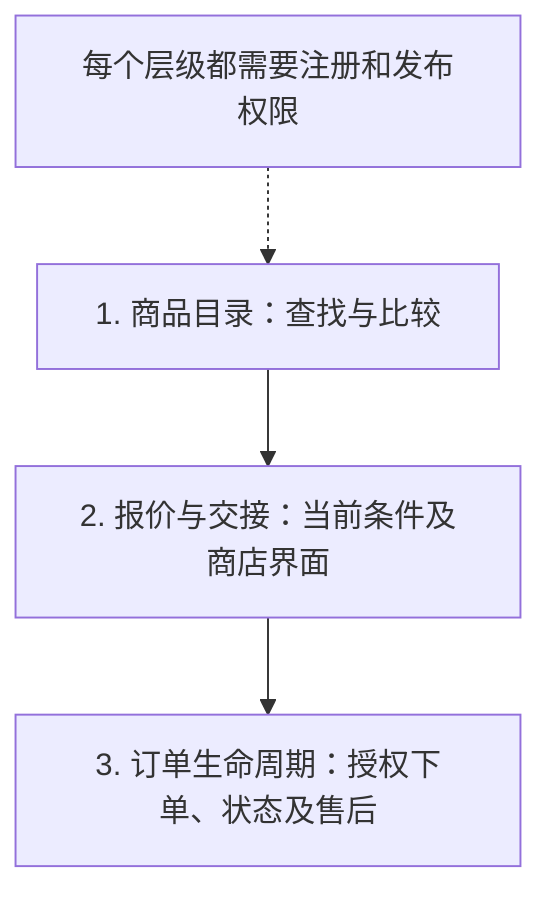
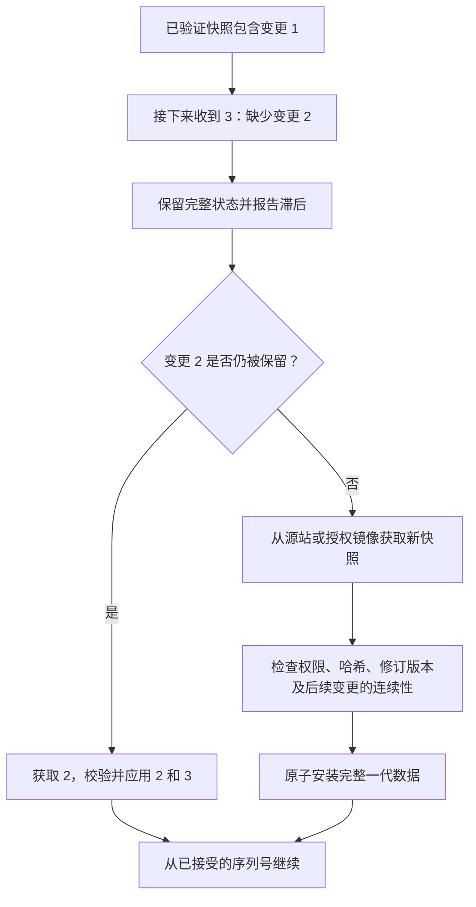
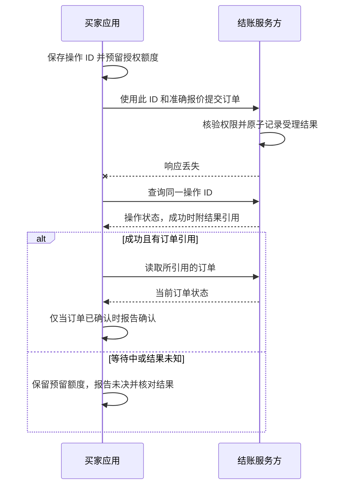

[English](how-it-works.md) | [Русский](how-it-works.ru.md) | [Español](how-it-works.es.md) | **简体中文**

# 五分钟了解 AMP

[返回 README](../README.zh-CN.md)

AMP 将买家的请求连接到卖家的商品目录和订单系统。独立索引帮助发现商品，
智能体解释候选方案，买家应用检查条件和授权，卖家或电商平台接受订单。

本指南解释实验草案，图示描述服务应有的行为。目前仓库提供文档和离线检查。
规范性规则以[英文规范](../SPEC.md)为准。

## 一次购买，四个阶段

**请求：**“一台至少有 16 GB 内存的笔记本电脑，送到柏林，总价低于 1,000 欧元。”
以下是虚构示例，以 2026-10-03 的测试时刻为准，并非当前在售商品。

| 阶段 | 买家看到的内容 | 背后的处理 |
|---|---|---|
| 1. 查找 | 候选列表和已查询的数据源 | 索引返回候选，应用检查硬性要求和数据时效 |
| 2. 比较 | 已知差异、缺失信息和价格构成 | 目录商品价格与包含配送的个性化总价分开处理 |
| 3. 授权 | 明确的卖家、商品、数量、总价和配送条件 | 可信交互记录有限授权，模型不能扩大权限 |
| 4. 完成 | 已确认订单、等待结果或明确拒绝 | 应用查询运营方的订单状态，支付状态单独核验 |

[示例搜索结果](../examples/valid/search-result.json)包含三个报价来源：

| 商品来源 | 内存 | 目录中的商品价格 | 获取报价前的运费和总价 |
|---|---|---|---|
| [卖家 A](../examples/valid/offer-a.json) | 16 GB | 899 EUR | 未知 |
| [卖家 B](../examples/valid/offer-b.json) | 16 GB | 949 EUR | 未知 |
| [通过平台销售的卖家 C](../examples/valid/offer-c.json) | 16 GB | 929 EUR | 未知 |

三个卖家都声明覆盖柏林，但这还不能证明可送达具体地址。
[卖家 A 的示例报价](../examples/valid/quote.json)随后确认：899 EUR + 10 EUR 运费
= **909 EUR**，该测试没有未知外部费用。示例未提供 B、C 的个性化报价，因此不能
确定哪个方案的含运费总价最低。报价默认也不代表已预留库存。

已有授权只能在其范围内使用。价格或地址发生变化时，可能需要新报价和新授权。
智能体可以把同一订单或会话交给人工界面；打开页面并不代表购买已完成。

## 谁负责什么

| 参与方 | 职责 | 权限边界 |
|---|---|---|
| 卖家 | 发布商品及当前交易条件 | 注册不能证明商品声明属实 |
| 索引 | 为声明覆盖的目录提供搜索 | 覆盖可能不完整，搜索结果不能授权支出 |
| 买家应用 | 保存意图、核查事实并执行授权限制 | 模型输出不能更改限额、凭证或信任关系 |
| 结账服务方 | 独立核验权限、接受订单并提供状态 | 平台需要每个所代表卖家的授权 |
| 注册表 | 保存目录登记及获准发布的密钥 | 不存储私人订单，也不决定哪个商品最好 |

注册表检查和公开索引支持商品发现。报价与订单发送给选定的获授权服务。
每笔购买不需要单独发起一笔新的目录注册交易。应用接受的注册状态仍须满足
网络对时效和故障处理的规定。

## 商店如何接入

以下是集成层级，并非已有安装包。商店可以选择需要的层级，并明确委托服务商
完成部分工作。

| 层级 | 商店需要接入的内容 | 兼容智能体可以做什么 |
|---|---|---|
| 商品目录 | 稳定标识、结构化属性、快照、变更和注册 | 查找、比较并打开商品 |
| 报价与交接 | 当前价格、地址校验及可信结账会话 | 准备购买，可能仍需买家手动完成 |
| 订单生命周期 | 授权执行、订单及状态接口、支持的售后操作 | 按集成规则完成并跟踪授权订单 |

所有参与活跃网络的层级都必须注册。支付注册费不保证每个索引都会收录目录。
托管服务可以在约定预算内处理注册和托管，卖家保留目录所有权及更换服务商的
途径。实际适配器和网络集成仍有待实现。

## 电商平台为什么参与

卖家 C 的示例保留平台的结账与配送角色。智能体带来买家，平台在约定权限下
继续处理订单并提供服务。当前配置要求每个卖家拥有独立目录和相应代理授权。

引荐归因在订单完成之前约定，费用、适用条件和退款后的处理由商业协议决定。
试点需要衡量新增确认订单、利润和客服工作量；这些收益目前尚未得到实测。

## 数据和资金流向哪里

| 流程 | 交换的数据 | 访问范围与支付 |
|---|---|---|
| 目录注册 | 目录身份、发布权限及内容承诺 | 公开注册表；服务代币费用及可能的底层链手续费 |
| 搜索与存储 | 允许复制的目录、粗略地区和必要筛选条件 | 独立服务协议；注册费不会自动支付这些服务 |
| 报价与订单 | 具体地址、接受的条件和订单信息 | 仅限获授权参与方；商品使用卖家支持的方式支付 |
| 引荐 | 符合协议条件的订单归因 | 卖家或平台按协议支付；相关激励须披露 |

支付凭证不进入模型提示词或公开目录。普通买家支付商品时不需要加密货币钱包。
网络服务代币仍是目录注册和续期的必要条件。

## 索引漏掉更新时

索引先加载验证过的快照，再按顺序应用变更。漏掉变更不能解释成“没有商品”。

重建失败时保留上一代完整数据，并如实标注时效。过期商品不能作为当前有效
结果。删除标记保留已删除商品的修订版本。数据源不可用或必需覆盖不完整时
要明确报告。如果所有授权副本都消失，注册表中的哈希无法恢复目录。

## 下单响应丢失时

操作 ID 在发送前保存。恢复时使用相同的 ID、买家身份、服务方和网络。
仅仅超时不能成为再次购买的授权。

操作成功本身不能证明已付款或订单已确认。超过服务方支持的重试保留期后，
自动重试停止，并执行具体集成规定的核对流程。订单和付款各自维护独立状态。

## 接下来阅读

- [接入指南](integration.md)：各角色及层级的职责。
- [完整示例](walkthrough.md)：同一购买过程中的具体消息。
- [目录](catalogs.md)与[搜索](search.md)：同步、时效和覆盖。
- [交易](transactions.md)：授权、幂等性和恢复。
- [符合性](conformance.md)：离线检查的边界以及需要实际运行服务才能验证的内容。
